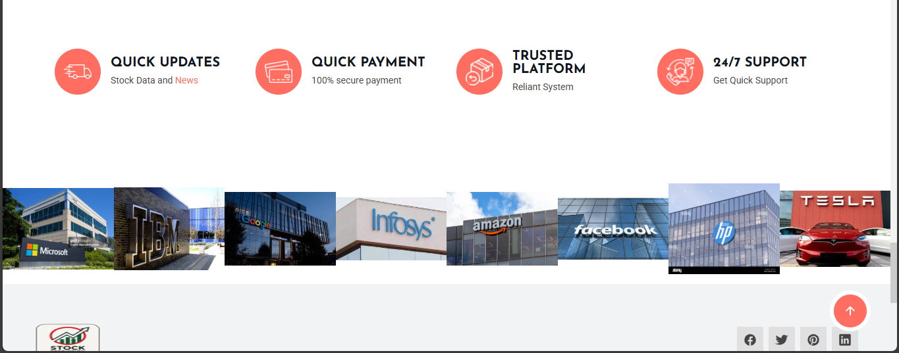

# 📈 Stock Market Prediction App

A web-based application using **Streamlit** to predict stock prices using **Random Forest** and **Prophet** models.

🟢 Live App: [https://kharatpatil.streamlit.app](https://kharatpatil.streamlit.app)

## Technologies Used
- Streamlit
- Python
- yfinance
- scikit-learn
- fbprophet
- pandas

## Keywords
Stock prediction, machine learning, data science, time series forecasting, yfinance, Streamlit, Python

## 🖼️ User Interface Preview
#🔮 Hero Section

# 🏢 MNC Company Section

