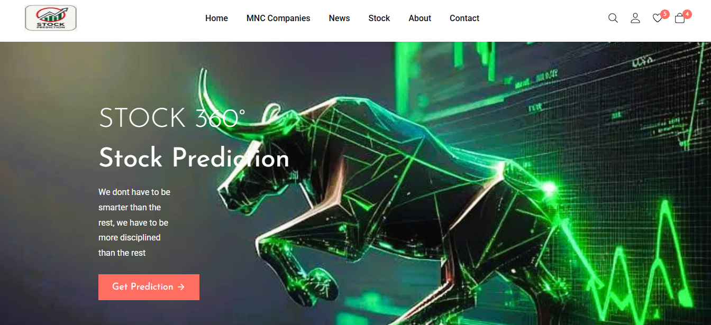

# 📈 Stock Market Prediction App

A web-based application using **Streamlit** to predict stock prices using **Random Forest** and **Prophet** models.

🟢 Live Website: [https://kharatpatil.github.io/stock-prediction/login.html](https://kharatpatil.github.io/stock-prediction/login.html)

🟢 Live Streamlit App: [https://kharatpatil.streamlit.app](https://kharatpatil.streamlit.app)

## Technologies Used
- Streamlit
- Python
- yfinance
- scikit-learn
- fbprophet
- pandas

## Keywords
Stock prediction, machine learning, data science, time series forecasting, yfinance, Streamlit, Python

## 🎨 GUI / Frontend Design
- ***Responsive across***
- mobile
- tablet
- desktop

## 🖼️ User Interface Preview
### 🔮 Frontend Section

## 📈 Stock Prediction Streamlit Output
### 🌲 Random Forest Prediction Output

